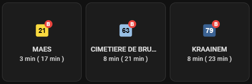

# STIB/MIVB — Home Assistant Integration

[](https://github.com/hacs/integration)
[](https://github.com/arszagi/hacs-stib-mivb/releases)
[](https://github.com/arszagi/hacs-stib-mivb/actions/workflows/validate.yml)
[](https://github.com/arszagi/hacs-stib-mivb/actions/workflows/hassfest.yml)

Monitor real-time waiting times for the **Brussels public transport network (STIB/MIVB)** directly in Home Assistant — buses, trams and metro.

---

## Features

- **One sensor per line per stop** — shows minutes until the next arrival
- **Grouped stops** — all physical platforms of the same stop name are handled as one
- **Bilingual** — French or Dutch display language
- **Official STIB line colours** — loaded from the GTFS feed at install time
- **Vehicle type detection** — bus / tram / metro per line, with label B / T / M
- **Service messages** — "Ne pas embarquer", "Ligne déviée", "Temps théorique"
- **Optimised API usage** — only your monitored stops are fetched (~2 KB per refresh instead of ~1 MB)
- **Configurable polling interval** (default 30 s, min 10 s)
- **Add stops at any time** via the integration options
- **Refresh line data** manually to get updated GTFS colours and types

---

## Prerequisites — API Key

1. Go to **[api-management-opendata-production.developer.azure-api.net](https://api-management-opendata-production.developer.azure-api.net/)**
2. Log in or create a free account
3. Go to your **Profile** page
4. Subscribe to the **"Standard"** product
5. Copy your **primary or secondary key** — you will need it during setup

---

## Installation via HACS

1. Open **HACS → Integrations → ⋮ → Custom repositories**
2. Paste `https://github.com/arszagi/hacs-stib-mivb` and select category **Integration**
3. Click **Download**
4. Restart Home Assistant

---

## Setup

1. Go to **Settings → Devices & Services → Add integration → STIB/MIVB**
2. Choose your **display language** (French or Dutch) and enter your **API key**
3. The integration validates the key and downloads the full stop catalogue (~2 400 stops) — this takes a few seconds
4. **Search** for a stop by typing part of its name (e.g. `forest`, `midi`, `schuman`)
5. **Select** the stop from the results — all platforms are grouped automatically
6. Repeat to add more stops, then click **Finish**

At first launch the integration also downloads the STIB GTFS feed to get official line colours and vehicle types. This is a one-time download; subsequent restarts use the cached data.

---

## Sensors

Each sensor is named **`Line <LINE> – <STOP> → <DESTINATION>`**. Home Assistant generates the entity ID from this name, typically as `sensor.line_<line>_<stop>_<destination>`. The sensor belongs to a **device** named after the stop group.

| State | Meaning |
|---|---|
| `3` | 3 minutes until the next vehicle |
| `0` | Vehicle at the stop |
| `unavailable` | API unreachable or coordinator refresh failed |

### Attributes

| Attribute | Type | Description |
|---|---|---|
| `current_passage` | ISO timestamp | Expected arrival time of the next vehicle |
| `next_passage` | ISO timestamp \| `None` | Expected arrival time of the vehicle after next (None if only one vehicle in queue) |
| `next_passage_minutes` | int \| `None` | Minutes until the vehicle after next |
| `destination` | string | Real-time destination (in your chosen language) |
| `message` | string | Service message from STIB — empty string when none (see below) |
| `is_boarding` | bool | `false` when the vehicle will not stop for passengers |
| `line_id` | string | Line number e.g. `"25"` |
| `line_type` | string | `"bus"`, `"tram"` or `"metro"` |
| `line_type_label` | string | `"B"`, `"T"` or `"M"` |
| `line_color` | string | Official STIB hex colour e.g. `"#A12944"` |
| `line_text_color` | string | Contrasting text colour — `#000000` on light backgrounds, `#FFFFFF` on dark |
| `stop_name_fr` | string | Stop name in French |
| `stop_name_nl` | string | Stop name in Dutch |
| `latitude` / `longitude` | float | Stop GPS coordinates |
| `point_ids` | list | Physical platform IDs grouped under this stop |

### Service messages

The `message` attribute reflects real-time flags on the current passage. It is an empty string during normal operation.

| `message` value | `is_boarding` | Meaning |
|---|---|---|
| *(empty)* | `true` | Normal operation |
| `Ne pas embarquer` | `false` | Vehicle will **not stop** for passengers (going to depot) |
| `Ligne déviée` | `true` | Line is **detoured** — different route than usual |
| `Temps théorique` | `true` | **No real-time data** — showing scheduled time only |

---

## Options

Go to **Settings → Devices & Services → STIB/MIVB → Configure** to:

| Option | Description |
|---|---|
| **Update interval** | Polling frequency in seconds (10–3600, default 30) |
| **Add another stop** | Search and add a new stop group |
| **Remove a stop** | Select and remove a configured stop group |
| **Refresh line colours & types** | Re-download the GTFS feed to get updated line colours and vehicle types |

---

## Lovelace examples

### Required custom card

The examples below use **[Mushroom](https://github.com/piitaya/lovelace-mushroom)**, a popular card collection available in HACS.

> HACS → Frontend → search **"Mushroom"** → Download → Restart HA

---

### Grid — multiple lines at the same stop



Each card shows the **official STIB line colour** as background, the **line number** in the matching text colour (black on yellow, white on dark), and a **B / T / M badge** in red indicating the vehicle type. The secondary line displays the service message when STIB sends one, otherwise shows the waiting times.

The line number square is generated as an inline SVG — **no image files required**.

```yaml
square: true
type: grid
cards:
  - type: custom:mushroom-template-card
    entity: sensor.line_21_michel_ange_maes
    picture: >-
      {% set color = state_attr('sensor.line_21_michel_ange_maes', 'line_color') | replace('#', '%23') %}
      {% set tcolor = state_attr('sensor.line_21_michel_ange_maes', 'line_text_color') | replace('#', '%23') %}
      
      
      data:image/svg+xml,<svg xmlns='http://www.w3.org/2000/svg' viewBox='0 0 100 100'><rect x='15' y='15' width='70' height='70' fill='{{ color }}' rx='10'/><text x='50' y='50' font-size='{{ size }}' font-family='Arial,sans-serif' text-anchor='middle' dominant-baseline='central' fill='{{ tcolor }}' font-weight='bold'>{{ num }}</text></svg>
    badge_text: "{{ state_attr('sensor.line_21_michel_ange_maes', 'line_type_label') }}"
    badge_color: red
    primary: "{{ state_attr('sensor.line_21_michel_ange_maes', 'destination') }}"
    secondary: >-
      
      {{ msg }}
      {{ states('sensor.line_21_michel_ange_maes') }} min
      ( {{ state_attr('sensor.line_21_michel_ange_maes', 'next_passage_minutes') }} min )
      
    color: "{{ state_attr('sensor.line_21_michel_ange_maes', 'line_color') }}"
    features_position: bottom
    vertical: true

  - type: custom:mushroom-template-card
    entity: sensor.line_63_michel_ange_cimetiere_de_bruxelles
    picture: >-
      {% set color = state_attr('sensor.line_63_michel_ange_cimetiere_de_bruxelles', 'line_color') | replace('#', '%23') %}
      {% set tcolor = state_attr('sensor.line_63_michel_ange_cimetiere_de_bruxelles', 'line_text_color') | replace('#', '%23') %}
      
      
      data:image/svg+xml,<svg xmlns='http://www.w3.org/2000/svg' viewBox='0 0 100 100'><rect x='15' y='15' width='70' height='70' fill='{{ color }}' rx='10'/><text x='50' y='50' font-size='{{ size }}' font-family='Arial,sans-serif' text-anchor='middle' dominant-baseline='central' fill='{{ tcolor }}' font-weight='bold'>{{ num }}</text></svg>
    badge_text: "{{ state_attr('sensor.line_63_michel_ange_cimetiere_de_bruxelles', 'line_type_label') }}"
    badge_color: red
    primary: "{{ state_attr('sensor.line_63_michel_ange_cimetiere_de_bruxelles', 'destination') }}"
    secondary: >-
      
      {{ msg }}
      {{ states('sensor.line_63_michel_ange_cimetiere_de_bruxelles') }} min
      ( {{ state_attr('sensor.line_63_michel_ange_cimetiere_de_bruxelles', 'next_passage_minutes') }} min )
      
    color: "{{ state_attr('sensor.line_63_michel_ange_cimetiere_de_bruxelles', 'line_color') }}"
    features_position: bottom
    vertical: true

  - type: custom:mushroom-template-card
    entity: sensor.line_79_michel_ange_kraainem
    picture: >-
      {% set color = state_attr('sensor.line_79_michel_ange_kraainem', 'line_color') | replace('#', '%23') %}
      {% set tcolor = state_attr('sensor.line_79_michel_ange_kraainem', 'line_text_color') | replace('#', '%23') %}
      
      
      data:image/svg+xml,<svg xmlns='http://www.w3.org/2000/svg' viewBox='0 0 100 100'><rect x='15' y='15' width='70' height='70' fill='{{ color }}' rx='10'/><text x='50' y='50' font-size='{{ size }}' font-family='Arial,sans-serif' text-anchor='middle' dominant-baseline='central' fill='{{ tcolor }}' font-weight='bold'>{{ num }}</text></svg>
    badge_text: "{{ state_attr('sensor.line_79_michel_ange_kraainem', 'line_type_label') }}"
    badge_color: red
    primary: "{{ state_attr('sensor.line_79_michel_ange_kraainem', 'destination') }}"
    secondary: >-
      
      {{ msg }}
      {{ states('sensor.line_79_michel_ange_kraainem') }} min
      ( {{ state_attr('sensor.line_79_michel_ange_kraainem', 'next_passage_minutes') }} min )
      
    color: "{{ state_attr('sensor.line_79_michel_ange_kraainem', 'line_color') }}"
    features_position: bottom
    vertical: true

columns: 3
grid_options:
  rows: auto
```

> **How the line number square works:** the `picture` field is a coloured rounded rectangle inscribed inside the circle that Mushroom clips pictures to. `line_color` sets the background, `line_text_color` sets the number colour automatically. No external image files are needed.

---

## Data sources

| Source | Endpoint | Used for |
|---|---|---|
| STIB Open Data | `rt/WaitingTimes` | Real-time arrivals, filtered by configured stops |
| STIB Open Data | `static/stopsByLine` | Line directions and canonical destinations |
| STIB Open Data | `static/StopDetails` | Stop catalogue (names, coordinates) |
| STIB GTFS | `routes.txt` | Official line colours and vehicle types |

All endpoints require the `bmc-partner-key` header with your API key.

---

## License

MIT
